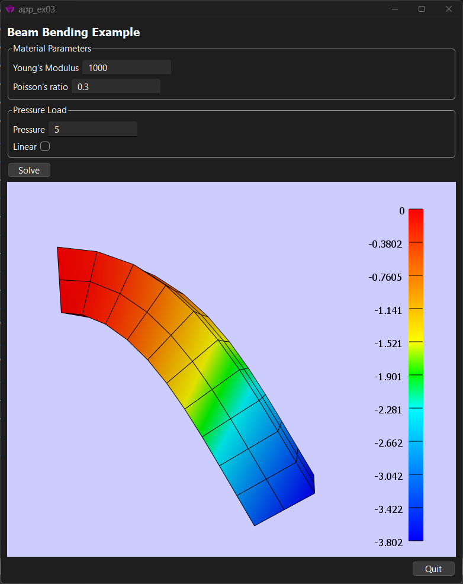

# FEBioApp
FEBioApp allows users to run FEBio apps, which are custom GUIs that control one or model FEBio models. Using an app, users can control model parameters, run the models, extract model data, and provide custom visualizations. Apps can also be used to run an FEBio model interactively.

FEBio apps are easy to create! An app is defined using an xml-based file. The app file defines the FEBio model as well as the UI elements. Some limited scripting functionality is available for creating more dynamic user interfaces. See the Examples folder for some simple examples that illustrate the rich capabilities of FEBio apps. 

The image below shows an example of an FEBio app. 

